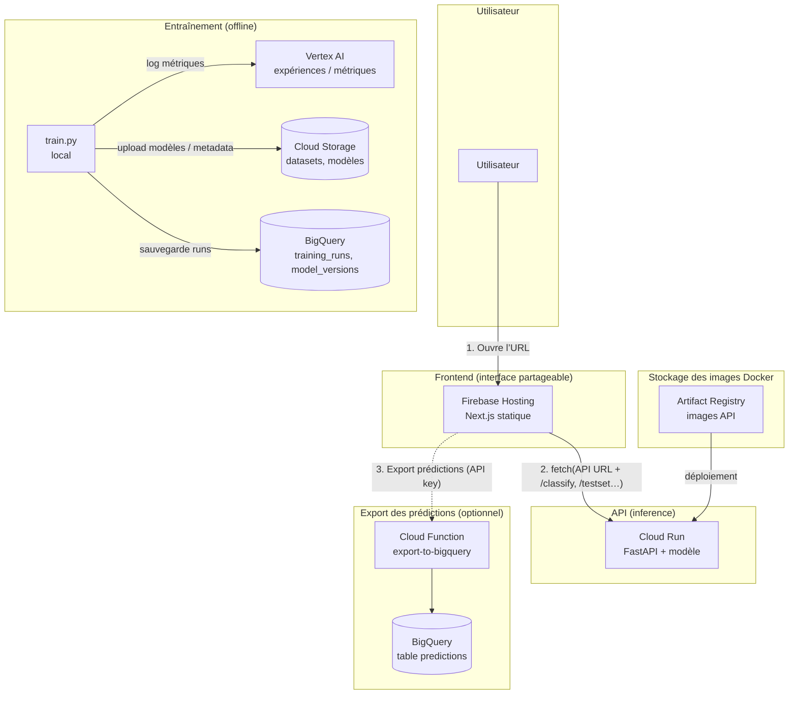

# Architecture et services

Vue d’ensemble de l’architecture du projet de classification e-commerce, des services utilisés et de leur rôle.

---

## Schéma d’architecture



---

## Flux résumés

| Flux | Parcours |
|------|----------|
| **Utilisation du classifieur** | Utilisateur → Firebase Hosting (UI) → Cloud Run (API) ; le front affiche résultats et graphiques. |
| **Export vers BigQuery** | Depuis le front, envoi des prédictions à la Cloud Function (avec clé API) → écriture dans BigQuery. |
| **Déploiement de l’API** | Build Docker → push image dans Artifact Registry → Cloud Run déploie cette image. |
| **Entraînement** | `train.py` en local (ou autre) → Vertex AI (métriques), GCS (modèles/datasets), BigQuery (runs/versions). |

---

## Services et rôles

### En production (runtime)

| Service | Rôle | Pourquoi ce choix |
|--------|------|--------------------|
| **Firebase Hosting** | Héberge le front Next.js (HTML/JS/CSS statiques). | URL publique partageable, gratuit pour un usage modéré, pas de serveur à gérer. Le front est en `output: 'export'`, donc uniquement des fichiers statiques. |
| **Cloud Run** | Exécute l’API FastAPI ( `/classify`, `/testset`, `/category-names`, etc.) dans un container. | Scalable, facturé à l’usage, tolérance aux pannes. Permet de déployer une image Docker avec le modèle et les données nécessaires. |
| **Artifact Registry** | Stocke les images Docker de l’API. | Nécessaire pour que Cloud Run puisse tirer l’image à déployer ; intégré à l’écosystème GCP. |
| **Cloud Function** (export BigQuery) | HTTP trigger : reçoit des prédictions du front et les insère dans BigQuery. | Serverless, déclenché à la demande. Permet de centraliser les prédictions sans gérer un serveur dédié. |
| **BigQuery** (table `predictions`) | Stocke les prédictions exportées depuis l’UI. | Requêtes analytiques et reporting sur l’usage du classifieur en prod. |

### Lors de l’entraînement (offline)

| Service | Rôle | Pourquoi ce choix |
|--------|------|--------------------|
| **Vertex AI** | Suivi des expériences (hyperparamètres, métriques). | Comparaison de runs, traçabilité des modèles, compatible avec le reste GCP. |
| **Cloud Storage (GCS)** | Stocke jeux de données et artefacts (modèles, metadata). | Persistance des datasets et des modèles, partage et reproductibilité. |
| **BigQuery** (tables `training_runs`, `model_versions`, `experiment_metrics`) | Enregistre runs, versions de modèles et métriques d’expériences. | Historique structuré pour analyse et audit des entraînements. |

### Outils / briques techniques (hors GCP)

| Élément | Rôle | Pourquoi |
|--------|------|----------|
| **Next.js** | Front (pages, composants, build statique). | Bonne DX, export statique adapté à Firebase Hosting, React. |
| **FastAPI** | Backend de l’API de classification. | Async, validation Pydantic, OpenAPI, adapté à un service d’inference. |
| **Docker** | Conteneurise l’API (dépendances, modèle, `testset`). | Déploiement reproductible sur Cloud Run ; même environnement en local et en prod. |

---

## Schéma simplifié (vue “production”)

```
 [Utilisateur]
       │
       ▼
 [Firebase Hosting]  ←── URL partageable du front (ex. xxx.web.app)
       │
       │  fetch(/classify, /testset, /category-names…)
       ▼
 [Cloud Run – API]   ←── URL partageable de l’API (ex. xxx.run.app)
       │
       │  (optionnel) export prédictions
       ▼
 [Cloud Function] ──► [BigQuery]
```

L’utilisateur n’a qu’à ouvrir l’URL Firebase et, dans l’UI, renseigner l’URL de l’API Cloud Run pour utiliser le classifieur et, si configuré, l’export des prédictions vers BigQuery.
